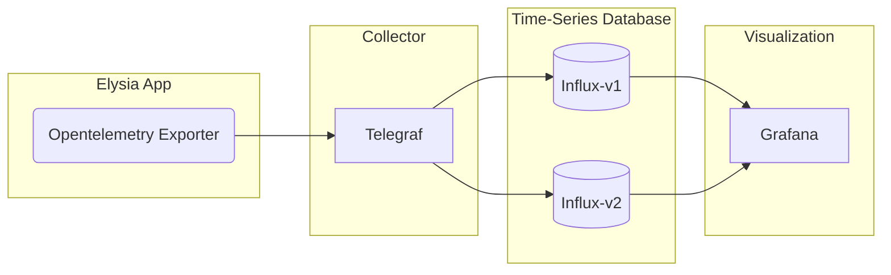
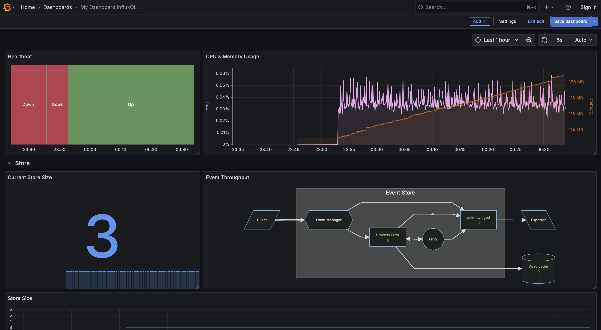
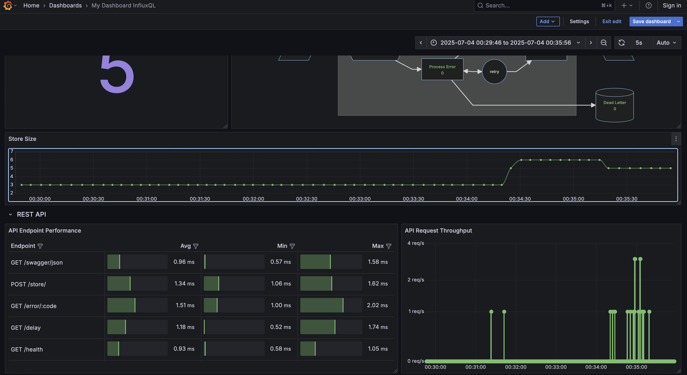

# Elysia Observability Example
This project showcases an observability stack.



## Development
To start the development server run:
```bash
docker compose up -d
bun run dev
```

## How to use
Elysia app: http://localhost:3000/swagger
Grafana: http://localhost:8282/dashboards

## Screenshots



